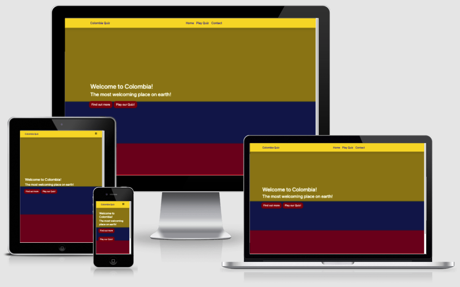

# Quiz of Colombia!
A website where users can play a quiz answering questions on the country of Colombia.\
[Link to website](https://hardingrichard.github.io/ci-ms2-quiz)

## Table Of Contents

1. [Key Project Goals](#key-project-goals)
    1. [Site Owner Goals](#site-owner-goals)
    2. [User Goals](#user-goals)
2. [Information Gathering](#information-gathering)
    1. [Target Audience](#target-audience)
    2. [User Requirements](#user-requirements)
    3. [User Stories](#user-stories)
3. [Site Design](#site-design)
    1. [Wireframes](#wireframes)
    2. [Design choice](#design-choice)
4. [Site Features](#linkhere)
5. [Technology stack](#linkhere)
    1. [Languages](#linkhere)
    2. [Frameworks and Tools](#linkhere)
6. [Testing](#linkhere)
    1. [Validation](#linkhere)
    2. [Performance](#linkhere)
    3. [Accessibility](#linkhere)
    4. [Compatability](#linkhere)
    5. [User Story testing](#linkhere)
7. [Bugs and Fixes](#linkhere)
9. [Deployment and Version Control](#linkhere)
10. [Credits and Acknowledgements](#linkhere)

## Key Project Goals

### Site Owner Goals
* Get people interested in the country and culture of Colombia
* Quiz to be played accross different devices
* To have and create a fun and challenging game for people to play

### User Goals
* Fun and challenging quiz to play
* Test General knowledge of colombia

## Information Gathering

### Target Audience
* People who like Trivia and testing their knowledge
* People who want to learn more about Colombia through trivia
* Web-browser gamers

### User Requirements
* Challenging and fun game to play
* Feedback on how scored with correct answers
* Intuitive site design to easily navigate
* Responsive to multiple devices
* Be Accessible
* Features to work as intended

### User Stories
No. | As a | I want to | so that
----|------|-----------|--------
1 | user | test my knowledge | i can see how much i know
2 | user | see how well i score | i can try and beat my previous
3 | user | see the correct answers | i can learn more 
4 | user | be able to restart the quiz | i can play again easily
5 | site owner | give users a way of retaking the quiz | to keep users engaged and increase replayability
6 | site owner | have users feel familiar with the page design | users are clear on what the quiz is to do with
7 | site owner | have a section detailing how to play | users can play without any confusion on what to do

## Site Design

### Wireframes

Quiz Landing page

### Design Choice
The website was created in a way in which to to make it intuitive and convenient for the user to navigate.
Using the national colours of Colombia (Yellow, Blue, Red) to bring familiary and make it clear what the site
has to do with and is about. The colours being bright and contrasting also provides an aspect of fun which
compliments the purpose of the website in which to play a game. The site was designed to be free from distracting 
elements from popping up on the screen and page links were used in the navigation bar to take the user straight to 
each section of the landing page than needing to scroll. The website consists of the one landing page which features 
a How To Play section giving users instructions on how to play, a Quiz section where the users can partake in the 
quiz and test their knowledge as well as a scores section so that users can see how well they did.