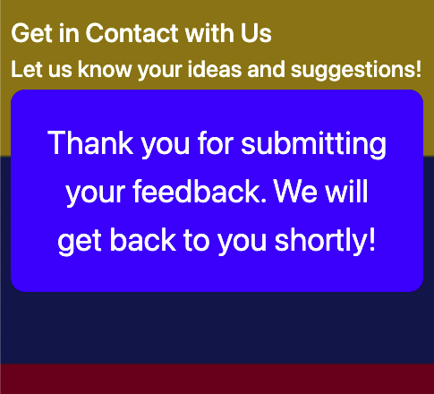

# Quiz of Colombia!
A website where users can play a quiz answering questions on the country of Colombia.\
[Link to website](https://hardingrichard.github.io/ci-ms2-quiz)

## Table Of Contents

1. [Key Project Goals](#key-project-goals)
    1. [Site Owner Goals](#site-owner-goals)
    2. [User Goals](#user-goals)
2. [Information Gathering](#information-gathering)
    1. [Target Audience](#target-audience)
    2. [User Requirements](#user-requirements)
    3. [User Stories](#user-stories)
3. [Site Design](#site-design)
    1. [Wireframes](#wireframes)
    2. [Design choice](#design-choice)
4. [Site Features](#linkhere)
5. [Technology stack](#linkhere)
    1. [Languages](#linkhere)
    2. [Frameworks and Tools](#linkhere)
6. [Testing](#linkhere)
    1. [Validation](#linkhere)
    2. [Performance](#linkhere)
    3. [Accessibility](#linkhere)
    4. [Compatibility](#linkhere)
    5. [User Story testing](#linkhere)
7. [Bugs and Fixes](#linkhere)
9. [Deployment and Version Control](#linkhere)
10. [Credits and Acknowledgements](#linkhere)

## Key Project Goals

### Site Owner Goals
* Get people interested in the country and culture of Colombia
* Quiz to be played accross different devices
* To have and create a fun and challenging game for people to play
* Provide a way of giving feedback on the quiz

### User Goals
* Fun and challenging quiz to play
* Test General knowledge of colombia

## Information Gathering

### Target Audience
* People who like Trivia and testing their knowledge
* People who want to learn more about Colombia through trivia
* Web-browser gamers

### User Requirements
* Challenging and fun game to play
* Feedback on how scored with correct answers
* Intuitive site design to easily navigate
* Responsive to multiple devices
* Be Accessible
* Features to work as intended

### User Stories
No. | As a | I want to | so that
----|------|-----------|--------
1 | user | test my knowledge | i can see how much i know
2 | user | see how well i score | i can try and beat my previous score
3 | user | see the correct answers | i can learn more about Colombia
4 | user | be able to restart the quiz | i can play again easily
5 | user | be able to easily navigate site | to access the features without difficulty
6 | user | have feedback on my form submit | i know that the form had submitted successfully
7 | site owner | give users a way of retaking the quiz | to keep users engaged and increase replayability
8 | site owner | have a section detailing how to play | users can play without any confusion on what to do
9 | site owner | provide a contact form | users can give feedback on the quiz
10 | site owner | allow users to find us on social media | brand awareness can be increased

## Site Design

### Wireframes

Home page

Quiz page

Contact page

404 page

### Design Choice
The website was created in a way in which to to make it intuitive and convenient for the user to navigate.
Using the national colours of Colombia (Yellow, Blue, Red) to bring familiary and make it clear what the site
has to do with and is about. This colour theming was used throughout the site with design and features. 
The colours being bright and contrasting also provides an aspect of fun which compliments the purpose of the 
website in which to play a game. Blue background was used with white text for the game instructions as this
improves readability and is more dyslexia friendly. The site was designed to be free from distracting elements 
from popping up on the screen and page links were used in the navigation bar to take the user straight to each 
section of the page than needing to scroll. The website consists of four pages: the home page, the quiz game page 
which features a How To Play section which provides users with instructions and the play quiz section where the 
users can partake in the quiz and test their knowledge as well as a scores section so that users can see how well 
they did. There is also a contact page where users can leave feedback and a 404 error page.

## Site Features
The website is made up of four pages which consist of 8 features:

### Navigation Bar
* Navbar on all pages for ease of navigation
* User story referenced: 5

### Footer 
* Copyright information
* Social media links
* User story referenced: 10

### How to Play
* Instructions on how to play the quiz
* User story referenced: 8

### Quiz game
* Quiz consisting of 10 questions
* Timer and progress bar
* Correct and incorrect answers shown when answering 
* User story referenced: 1,2,3,4,7

### Quiz results overlay
* Feedback post quiz to let user know how well they scored vs max score
* Button to prompt user back to quiz page where quiz can be replayed
* User story referenced: 2,4,7

### Contact form
* Allows for users to provide feedback on the quiz and site
* Provides 
* User story referenced: 9

### Form submit confirmation
* Feedback to the user that the form has been submitted
* User story referenced: 6

### 404 error page
* Feedback to the user that a non-existant link was navigated
* Allows user to return to home page
* User story referenced: 5

## Technology Stack

### Languages
* HTML
* CSS
* JavaScript

### Frameworks and Tools
* Git
* Github
* Gitpod
* Balsamiq wireframes
* Favicon.io
* Google fonts
* Bootstrap v5
* JSHint linter
* Google Lighthouse
* WAVE WebAIM accessibility evaluation
* W3C Jigsaw CSS Validation
* W3C Markup Validation
* EmailJS 

## Testing

### Validation

#### HTML Validation
The HTML was validated using the W3C Markup validation service. Each website page passed with
zero errors or warnings.

Home page

Quiz page

Contact page

404 page

#### CSS Validation
The CSS was validated using the W3C CSS Validation Service. The CSS had passed with zero 
errors or warnings

CSS

#### JavaScript Validation
The Javascript code was validated using the linter JSHint Static Code Analysis Tool. 
There were no issues found with either .js files and only warnings relating to ES6 
version for using the 'let' variable declaration. JavaScript validation code was used
with creating the contact form to provide the user with feedback of incorrect data
entry or missed inputs.

quiz.js

contact.js

### Performance
The google Lighthouse tool was used within the Google Chrome Developer tools to evaluate
and test the performance of the website pages.

Home Page

Quiz Page

Contact Page

404 Page

### Accessibility
The accessibility standards of the website was validated and evaluated using the WAVE WebAIM web
accessibility evaluation tool. All pages returned zero errors.

Home Page

Quiz Page

Contact Page

404 Page

### Compatibility
The website was tested using the following browsers:
* Google Chrome
* Mozilla Firefox

The website was tested using Chrome Developer Tools devices option as well as the following physical devices:
* iphone SE 2020
* iPad pro
* Macbook pro
* Huawei mate 20 pro

### User Story Testing
Testing of the User Stories identified towards the top of the README are as follows:

>  No. | As a | I want to | so that
>  ----|------|-----------|--------
> 1 | user | test my knowledge | i can see how much i know

Site Feature | Path of Action | Outcome | Testing Result
-------------|----------------|---------|----------------
Quiz Game | Navigate to quiz page and scroll down to begin quiz | Quiz displays ready for user selection, all selections work through to end of quiz | Worked as intended

>  No. | As a | I want to | so that
>  ----|------|-----------|--------
> 2 | user | see how well i score | i can try and beat my previous score

Site Feature | Path of Action | Outcome | Testing Result
-------------|----------------|---------|----------------
Quiz Game | Navigate to quiz page and scroll down to begin quiz | Quiz displays and a score is shown increasing with every correct answer | Worked as intended
Quiz results overlay | Navigate to quiz and complete quiz | On completion of quiz the result page displays showing the score out of 100 | Worked as intended

>  No. | As a | I want to | so that
>  ----|------|-----------|--------
> 3 | user | see the correct answers | i can learn more about Colombia

Site Feature | Path of Action | Outcome | Testing Result
-------------|----------------|---------|----------------
Quiz Game | Navigate to quiz page and scroll down to begin quiz | Everytime an answer was answered correctly, feedback was given to the user by the option colouring green | Worked as intended

>  No. | As a | I want to | so that
>  ----|------|-----------|--------
> 4 | user | be able to restart the quiz | i can play again easily

Site Feature | Path of Action | Outcome | Testing Result
-------------|----------------|---------|----------------
Quiz results overlay | Navigate to quiz page and scroll down to begin quiz and answer questions until end | on completion of quiz a result overlay is displayed where the user can click a button to refresh page to start quiz again | Worked as intended

>  No. | As a | I want to | so that
>  ----|------|-----------|--------
> 5 | user | be able to easily navigate site | to access the features without difficulty

Site Feature | Path of Action | Outcome | Testing Result
-------------|----------------|---------|----------------
Navigation bar | At the top of each page on every page the navbar is displayed | Navbar is always accessible due to being in a sticky position so when scrolling you can still easily access to navigate around the site | Worked as intended
404 error page | produced an incorrect navigation by causing a typo in the url | 404 error page presented where the user can click the return home button to easily navigate back to homepage or make use of the navbar at the top | Worked as intended

>  No. | As a | I want to | so that
>  ----|------|-----------|--------
> 6 | user | have feedback on my form submit | i know that the form had submitted successfully

Site Feature | Path of Action | Outcome | Testing Result
-------------|----------------|---------|----------------
Form submit confirmation | Navigate to contact page and fill in contact form then clicking submit | On submitting contact form a message prompt is shown displaying "Thank you for submitting your feedback. We will get back to you shortly! An emailJS form is then sent to the site owner | Worked as intended

>  No. | As a | I want to | so that
>  ----|------|-----------|--------
> 7 | site owner | give users a way of retaking the quiz | to keep users engaged and increase replayability

Site Feature | Path of Action | Outcome | Testing Result
-------------|----------------|---------|----------------
Quiz results overlay | Navigate to quiz page and complete the quiz | On completion of quiz a results overlay is shown where the user can then click a button to return to the quiz page | Worked as intended

>  No. | As a | I want to | so that
>  ----|------|-----------|--------
> 8 | site owner | have a section detailing how to play | users can play without any confusion on what to do

Site Feature | Path of Action | Outcome | Testing Result
-------------|----------------|---------|----------------
How to Play | Navigate to the quiz page and scroll down to blue section of screen | On scrolling of the page a large blue section with a ? graphic is shown with step by step instructions displayed on the side that is easy to read and follow | Worked as intended

>  No. | As a | I want to | so that
>  ----|------|-----------|--------
> 9 | site owner | provide a contact form | users can give feedback on the quiz

Site Feature | Path of Action | Outcome | Testing Result
-------------|----------------|---------|----------------
Contact form | Navigate to contact page | On navigation to the contact page a contact form is presented with JavaScript validation to ensure the correct entries are input. On submission of form, the data is sent to the site owner email inbox using emailJS. | Worked as intended

>  No. | As a | I want to | so that
>  ----|------|-----------|--------
> 10 | site owner | allow users to find us on social media | brand awareness can be increased

Site Feature | Path of Action | Outcome | Testing Result
-------------|----------------|---------|----------------
Footer | Scroll to bottom of each webpage | footer is displayed showing three logo's that can be clicked and navigated to the relevant social media platform | worked as intended

## Bugs and Fixes

## Deployment and Version Control

## Credits and Acknowledgements
